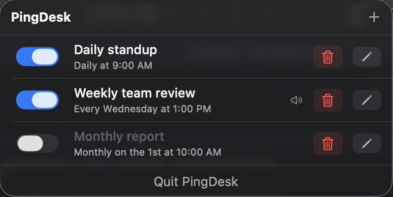

# PingDesk

A native macOS menu bar app for scheduling recurring and one-time reminders with system notifications.



## Features

- Lives in the menu bar — no Dock icon, always accessible
- Recurring reminders: daily, weekly (specific weekday), monthly (specific day)
- One-time reminders at a specific date and time
- Custom system sounds per reminder (Ping, Glass, Hero, and more)
- Data persisted locally in `~/Library/Application Support/PingDesk/reminders.json`
- No external dependencies — pure Swift + SwiftUI

## Requirements

- macOS 13 Ventura or later

## Build from Source

**Requirements:** Swift 5.9+ (Xcode Command Line Tools or Xcode)

```bash
git clone https://github.com/pkarnas/pingdesk.git
cd pingdesk
make bundle
make install   # copies to /Applications
```

Or run directly without installing:

```bash
make run
```

## Project Structure

```
Sources/PingDesk/
├── PingDeskApp.swift           # App entry point, MenuBarExtra scene
├── Models/
│   ├── Reminder.swift          # Reminder data model
│   └── Schedule.swift          # Schedule enum (recurring / one-time)
├── ViewModels/
│   └── ReminderStore.swift     # CRUD, JSON persistence, notification scheduling
├── Views/
│   ├── MenuPopoverView.swift   # Main popover window
│   ├── ReminderRowView.swift   # Single reminder row
│   ├── ReminderEditView.swift  # Add/edit reminder form
│   └── SoundPickerView.swift   # System sound picker
└── Services/
    └── NotificationService.swift  # UNUserNotificationCenter wrapper
```

## License

MIT — see [LICENSE](LICENSE)
